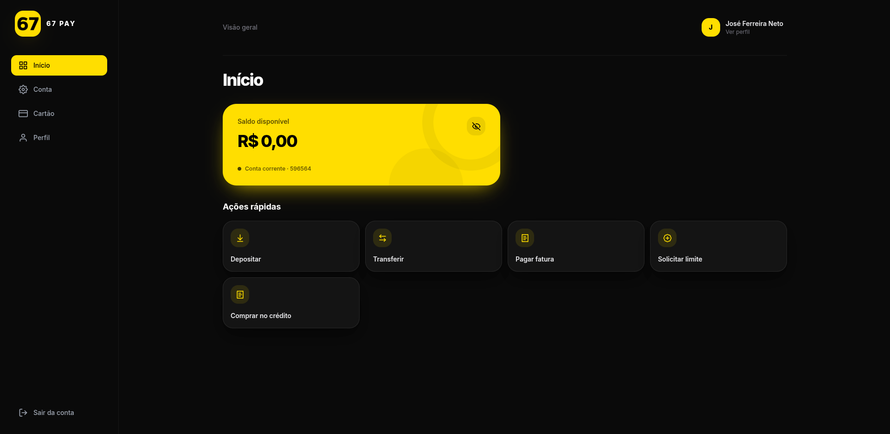
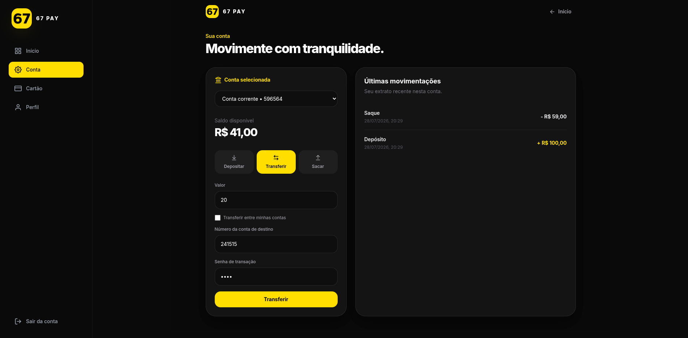
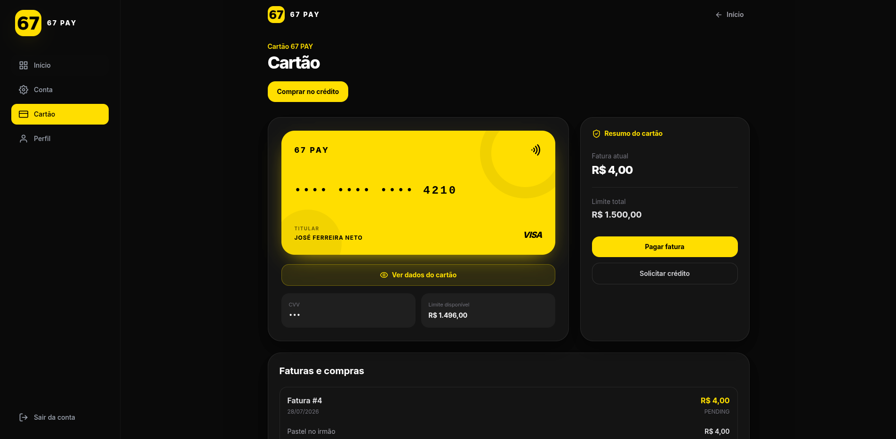
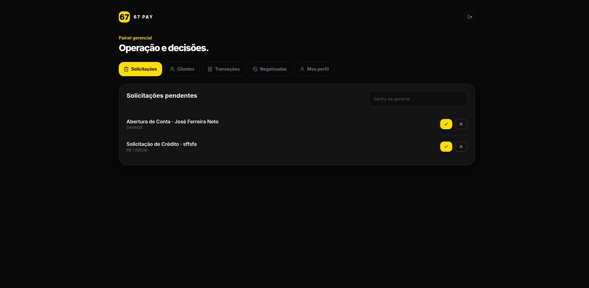
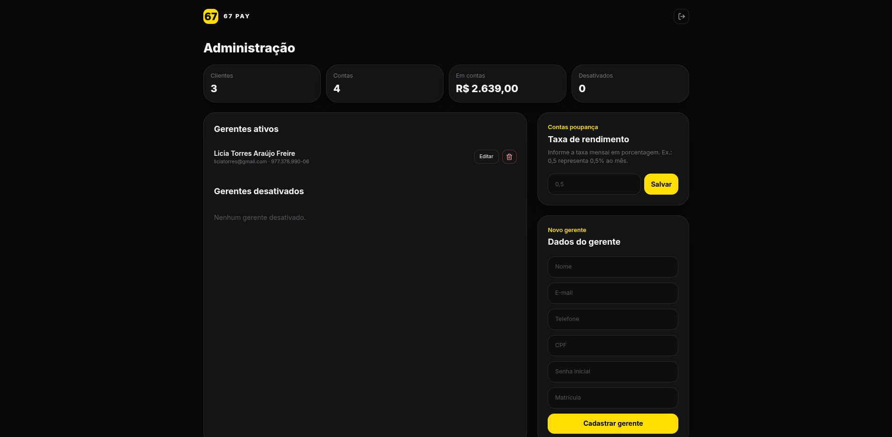

<div align="center">


# 67 PAY

### Sistema Bancário Digital

Uma aplicação full stack que simula operações e processos de uma instituição bancária digital, desenvolvida como projeto da disciplina de **Programação Orientada a Objetos** do curso de Ciência da Computação da **Universidade Federal do Cariri (UFCA)**.

<br>


</div>

---

## Sobre o projeto

O **67 PAY** é um sistema bancário digital voltado a pessoas físicas, desenvolvido com o objetivo de aplicar, em um projeto completo, conceitos de **Programação Orientada a Objetos**, modelagem de domínio, persistência de dados, desenvolvimento de APIs REST e integração entre backend e frontend.

A aplicação simula diferentes processos encontrados em um ambiente bancário, permitindo que clientes realizem movimentações financeiras e utilizem serviços de crédito, enquanto gerentes analisam solicitações e administradores acompanham informações globais do sistema.

O acesso ao sistema é dividido entre três perfis:

- **Cliente:** utiliza contas, realiza transações, gerencia cartão de crédito, faturas e solicitações.
- **Gerente:** analisa solicitações, administra contas e consulta informações gerenciais.
- **Administrador:** gerencia os funcionários do sistema, acompanha métricas e configura o rendimento das contas poupança.

> Este é um projeto acadêmico desenvolvido para fins de aprendizado e demonstração. O sistema não foi projetado para utilização bancária em ambiente de produção.

---

## Funcionalidades

### Cliente

O cliente possui acesso às principais operações bancárias do sistema:

- Cadastro e autenticação;
- Conta corrente criada automaticamente no cadastro;
- Consulta de saldo;
- Depósitos;
- Saques;
- Transferências entre clientes;
- Transferências entre contas próprias;
- Consulta do histórico de transações;
- Solicitação de abertura de conta poupança;
- Solicitação de cartão de crédito;
- Solicitação de aumento de limite;
- Consulta de cartão e limite disponível;
- Realização de compras no crédito;
- Consulta de compras e faturas;
- Pagamento de faturas;
- Atualização de dados pessoais;
- Alteração de senha;
- Solicitação de encerramento do perfil.

### Gerente

O gerente é responsável pela análise de solicitações e pelo acompanhamento das contas dos clientes:

- Consulta de solicitações pendentes;
- Aprovação ou rejeição de solicitações de conta poupança;
- Aprovação ou rejeição de solicitações de crédito;
- Análise de solicitações de encerramento;
- Consulta de clientes e suas contas;
- Bloqueio e desbloqueio de contas;
- Consulta das movimentações realizadas no banco;
- Consulta de contas com saldo negativo.

### Administrador

O administrador possui uma visão global do sistema e é responsável pela gestão dos gerentes:

- Visualização das métricas gerais do banco;
- Cadastro de gerentes;
- Edição de informações de gerentes;
- Desativação de gerentes;
- Consulta de gerentes ativos e inativos;
- Configuração da taxa mensal de rendimento da poupança;
- Acompanhamento de contas, clientes, saldos e solicitações.

---

## Regras de negócio

Além das operações básicas, o sistema implementa diferentes regras para manter a consistência dos processos bancários.

Entre elas:

- Contas bloqueadas, inativas ou encerradas não podem realizar movimentações;
- Saques dependem da existência de saldo disponível;
- A conta corrente possui **R$ 500,00 de limite de cheque especial**;
- Transferências validam conta de origem, conta de destino, status e senha de transação;
- Uma transferência não pode ter a própria conta como destino;
- Solicitações duplicadas do mesmo tipo não podem permanecer pendentes simultaneamente;
- Um cliente que já possui conta poupança não pode solicitar outra;
- Compras no crédito dependem de cartão, CVV, senha transacional e limite disponível;
- O pagamento da fatura deve ser realizado por uma conta pertencente ao titular do cartão;
- Faturas já pagas não podem ser pagas novamente;
- O encerramento do perfil depende da ausência de saldo nas contas e de dívidas pendentes;
- Apenas poupanças ativas e com saldo positivo recebem rendimento;
- O rendimento da poupança é processado apenas uma vez por mês.

---

## Programação Orientada a Objetos

Como o projeto foi desenvolvido para a disciplina de **Programação Orientada a Objetos**, a modelagem do domínio utiliza diferentes conceitos de POO para representar os elementos do sistema bancário.

### Abstração

Entidades mais genéricas do domínio foram representadas por classes abstratas, que concentram atributos e comportamentos compartilhados.

Alguns exemplos são:

```text
User
 ├── Customer
 └── Employee
      ├── Manager
      └── Administrator

Account
 ├── CheckingAccount
 └── SavingsAccount
```

Dessa forma, conceitos comuns são definidos em classes mais gerais enquanto suas especializações implementam características próprias.

### Herança

A herança é utilizada para criar especializações a partir das entidades principais.

Por exemplo, `CheckingAccount` e `SavingsAccount` compartilham características definidas em `Account`, enquanto `Manager` e `Administrator` aproveitam os atributos definidos para usuários e funcionários.

Isso reduz repetição de código e permite representar as relações existentes entre os elementos do domínio.

### Polimorfismo

Algumas especializações modificam comportamentos herdados.

Um exemplo ocorre em `CheckingAccount`, que sobrescreve o comportamento relacionado à verificação e realização de débitos para considerar também o limite de cheque especial da conta.

Assim, diferentes tipos de conta podem responder de maneira diferente a uma mesma operação.

### Encapsulamento

Os dados das entidades são mantidos dentro das próprias classes, enquanto métodos são utilizados para consultar ou alterar seus estados.

Essa abordagem permite concentrar regras e comportamentos próximos aos objetos aos quais pertencem, evitando acesso indiscriminado aos seus dados internos.

### Modelagem de domínio

O sistema possui entidades específicas para representar elementos como:

- Usuários;
- Clientes;
- Funcionários;
- Contas;
- Transações;
- Cartões de crédito;
- Compras;
- Faturas;
- Solicitações;
- Configurações do sistema.

Também são utilizados `Enums` para representar estados e categorias bem definidos, como:

- Status de conta;
- Tipo de conta;
- Tipo de transação;
- Status de fatura;
- Status de solicitação;
- Tipo de solicitação.

---

## Arquitetura

O projeto é dividido em duas partes principais:

```text
67 PAY
│
├── Backend
│   └── Java + Spring Boot
│
└── Frontend
    └── React + TypeScript
```

O frontend consome os endpoints disponibilizados pela API REST e apresenta interfaces diferentes conforme o perfil autenticado.

### Backend

O backend está localizado em:

```text
src/main/java/br/com/ufca/sixsevenpayapi
```

Sua organização principal é:

```text
sixsevenpayapi/
│
├── application/
│   ├── dto/
│   └── service/
│
├── common/
│
├── controller/
│
├── domain/
│   ├── entity/
│   ├── enums/
│   └── utils/
│
├── repository/
│
└── SixSevenPayApiApplication.java
```

A aplicação separa responsabilidades entre:

| Camada | Responsabilidade |
|---|---|
| `controller` | Recebimento das requisições HTTP e exposição da API REST |
| `application/dto` | Objetos utilizados na entrada e saída de dados |
| `application/service` | Regras e operações da aplicação |
| `domain/entity` | Entidades responsáveis pela representação do domínio bancário |
| `domain/enums` | Estados e categorias utilizados pelas entidades |
| `repository` | Persistência e acesso aos dados |
| `common` | Recursos compartilhados pela aplicação |

### Frontend

A interface está localizada na pasta:

```text
frontend/
```

A estrutura principal é:

```text
frontend/src/
│
├── components/
├── pages/
├── services/
├── styles/
├── types/
├── utils/
├── App.tsx
└── main.tsx
```

Os serviços do frontend são responsáveis pela comunicação com a API, enquanto páginas e componentes constroem as interfaces utilizadas pelos diferentes perfis do sistema.

---

## Tecnologias utilizadas

### Backend

| Tecnologia | Utilização |
|---|---|
| **Java 21** | Linguagem principal do backend |
| **Spring Boot** | Desenvolvimento da aplicação e da API REST |
| **Spring Web** | Construção dos endpoints HTTP |
| **Spring Data JPA** | Persistência e acesso aos dados |
| **Hibernate** | Mapeamento objeto-relacional |
| **H2 Database** | Banco de dados utilizado pela aplicação |
| **Jakarta Validation** | Validação de dados |
| **Maven** | Gerenciamento do projeto e dependências |
| **Springdoc OpenAPI** | Documentação interativa da API |

### Frontend

| Tecnologia | Utilização |
|---|---|
| **React** | Construção da interface |
| **TypeScript** | Desenvolvimento tipado do frontend |
| **Vite** | Ambiente de desenvolvimento e build |
| **Tailwind CSS** | Estilização da aplicação |
| **Axios** | Comunicação com a API |
| **React Router DOM** | Navegação entre páginas |
| **Lucide React** | Ícones da interface |

---

## 🖥️ Interface

### Experiência do cliente

<p align="center">
  
</p>

<p align="center">
  
  
</p>

### Gerenciamento

<p align="center">
  
  
</p>

---
## API REST

A comunicação entre o frontend e o backend é realizada através de uma API REST.

Os principais grupos de endpoints são:

| Recurso | Endpoint base | Responsabilidade |
|---|---|---|
| Autenticação | `/api/auth` | Login, cadastro, senha e encerramento |
| Clientes | `/api/customers` | Perfil e contas do cliente |
| Contas | `/api/accounts` | Saldo, depósitos, saques, transferências e extrato |
| Cartões | `/api/credit-cards` | Cartão, compras, faturas e pagamentos |
| Solicitações | `/api/requests` | Solicitações de conta e crédito |
| Gerência | `/api/managers` | Clientes, contas, relatórios e solicitações |
| Administração | `/api/admin` | Métricas, gerentes e configuração da poupança |

### Swagger / OpenAPI

Com o backend em execução, a documentação interativa da API pode ser acessada em:

```text
http://localhost:8080/swagger-ui/index.html
```

---

## Banco de dados

O projeto utiliza o **H2 Database**.

Os dados são persistidos localmente em:

```text
database/paydb.mv.db
```

Ao iniciar a aplicação pela primeira vez, o banco de dados e as configurações iniciais necessárias são criados automaticamente.

---

## Como executar

### Pré-requisitos

Antes de começar, é necessário possuir:

- **Java 21 ou superior**
- **Node.js 20 ou superior**
- **Git**

Não é necessário instalar o Maven separadamente, pois o projeto possui **Maven Wrapper**.

### 1. Clone o repositório

```bash
git clone https://github.com/liciaat/sistema-bancario.git
```

Entre na pasta do projeto:

```bash
cd sistema-bancario
```

### 2. Execute o backend

#### Linux / macOS

```bash
./mvnw spring-boot:run
```

#### Windows

```powershell
.\mvnw.cmd spring-boot:run
```

Após a inicialização, a API estará disponível em:

```text
http://localhost:8080
```

### 3. Execute o frontend

Abra outro terminal e acesse a pasta do frontend:

```bash
cd frontend
```

Instale as dependências:

```bash
npm install
```

Inicie o servidor de desenvolvimento:

```bash
npm run dev
```

A aplicação ficará disponível, por padrão, em:

```text
http://localhost:5173
```

---

## Primeiro acesso

Na primeira inicialização, o sistema cria automaticamente uma conta administrativa para permitir a configuração e utilização inicial da aplicação.

Para testes locais:

| Campo | Valor |
|---|---|
| CPF | `00000000000` |
| Senha | `admin` |

A partir do painel administrativo é possível cadastrar os gerentes que utilizarão o sistema.

> As credenciais acima pertencem exclusivamente ao ambiente acadêmico/local do projeto.

---

## Fluxo básico de utilização

Uma forma de explorar as principais funcionalidades do sistema é:

```text
Administrador
     │
     └── Cadastra gerente
              │
              ▼
Cliente ──► Cadastro ──► Conta corrente
   │
   ├── Depósito
   ├── Saque
   ├── Transferência
   │
   ├── Solicita conta poupança ──► Gerente aprova/rejeita
   │
   └── Solicita crédito ─────────► Gerente aprova/rejeita
                                         │
                                         ▼
                                  Cartão de crédito
                                         │
                                  Compra / Fatura
                                         │
                                  Pagamento da fatura
```

Além desses fluxos, o administrador pode acompanhar indicadores gerais e configurar a taxa utilizada no rendimento mensal das contas poupança.

---

## Contexto acadêmico

O **67 PAY** foi desenvolvido como projeto da disciplina de:

**Programação Orientada a Objetos**

do curso de:

**Ciência da Computação**

da:

**Universidade Federal do Cariri — UFCA**

O projeto teve como objetivo transformar conceitos estudados durante a disciplina em uma aplicação maior, na qual objetos, relacionamentos, regras de negócio e persistência precisassem funcionar de forma integrada.

---

## Equipe

O projeto foi desenvolvido por:

| Integrante |
|---|
| **Guilherme Belo Fontes** |
| **Joana Alice de Oliveira Teles** |
| **Jonatas Candido Rodrigues** |
| **José Clayto Moreira de Souza** |
| **Lícia Torres Araújo Freires** |

---

<div align="center">

### 67 PAY

**Projeto acadêmico desenvolvido na Universidade Federal do Cariri.**

</div>